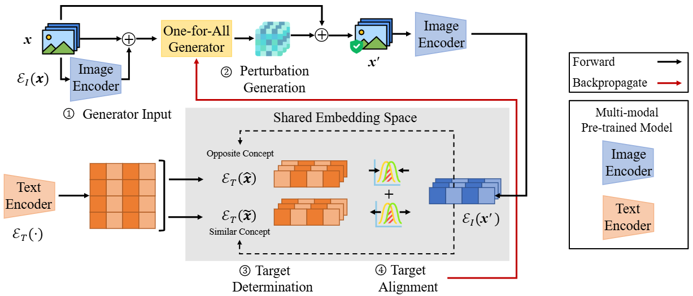

# <center> One for All: A Universal Generator for Concept Unlearnability via Multi-Modal Alignment </center>

[comment]: <> ([![License: MIT]&#40;https://img.shields.io/badge/License-MIT-yellow.svg&#41;]&#40;LICENSE&#41;)
<div align="center">
  <a href="https://github.com/xiye7lai/UnlearnableConcept">
    
  </a>
  <a href="https://github.com/xiye7lai/UnlearnableConcept">
    
  </a>
</div>


<table align="center">
  <tr>
    <td align="center"> 
       
      <br>
      <em style="font-size: 18px;">  <strong style="font-size: 18px;">Figure 1:</strong> Training scheme of One-for-All (14A) generator. </em>
    </td>
  </tr>
</table>


## Abstract
The abundance of free internet data offers unprecedented opportunities for researchers and developers, but it also poses privacy risks. Utilizing data without explicit consent raises critical challenges in protecting personal information. Unlearnable examples have emerged as a feasible protection approach, which renders the data unlearnable, i.e., useless to third parties, by injecting imperceptible perturbations. However, these perturbations only exhibit unlearnable effects on either a particular dataset or label-consistent scenarios, thereby lacking broad applicability. To address both issues concurrently, we propose a universal perturbation generator that harnesses data with concept unlearnability, thereby broadening the scope of unlearnability beyond specific datasets or labels. Specifically, we leverage multi-modal pre-trained models to establish a connection between the data concepts in a shared embedding space. This connection enables the information transformation from image data to text concepts. Consequently, we can align the text embedding using concept-wise discriminant loss, and render the data unlearnable. Extensive experiments conducted on real-world datasets demonstrate the concept unlearnability, i.e., cross-dataset transferability and label-agnostic utility, of our proposed unlearnable examples, and their robustness against attacks.

## Usage

We provide a python script 'main.py' to train the unlearanble examples generator.</br>
After training the generator , you can ran 'unlearnable.py' to generate the unlearnable examples and use them to train a model, where you can configure the dataset, model, if label-agnostic, hyper-parameters, and other settings. </br>
Below is an example:

```bash
python unlearnable.py --device 0 --stage generate --dataset pet --method our --model resnet --la
```

## Citation
